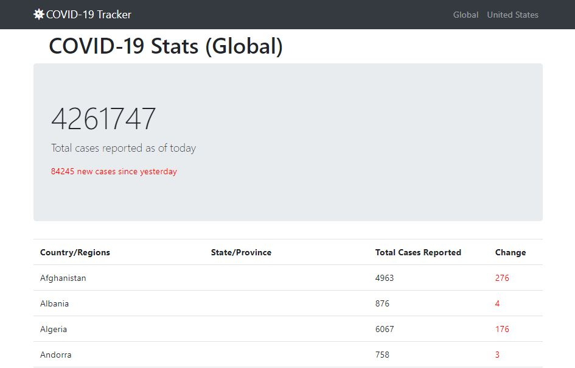
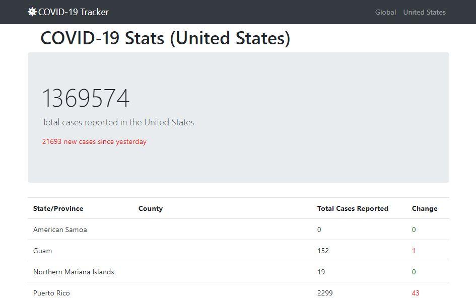
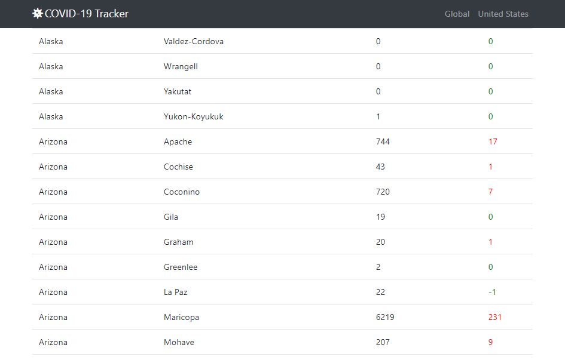

# COVID-19 Tracker

### Built using Spring Boot and Java 11
Data Source: [JHU CSSE](https://github.com/CSSEGISandData/COVID-19/tree/master/csse_covid_19_data).

#### Screenshots

#### Steps
1. Visit [Spring Initializer](start.spring.io).
2. Generate Maven-Java project with Spring version 2.2.5 and Java 11. Add dependencies- Thymeleaf, Spring Boot DevTools and Spring Web.
3. Unzip the generated zip file and open the project in [IntelliJ Idea](https://www.jetbrains.com/idea/).
4. Select Maven. Open pom.xml file, if it has errors in dependencies, check if Maven plugin is installed. Right click and reimport dependencies.
5. Make sure the compiler version is Java 11.
6. Add the all the files. Run the project. It would be available on localhost:8080.